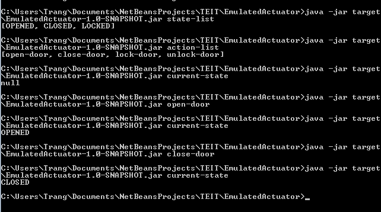

### 1. INTRODUCE

#### 1.1.MOTIVATION

Like a sensor, an actuator is a basic part of  IoT system, focus on the control part of the system. Implementing Emulated Actuator is applied in developing IoT system. 

#### 1.2. OVERVIEW

Emulated Actuator is designed based on the operation principles of real actuator. These operation principles as below:

* Actuator has a set of state values, e.g. on/off 

* Actuator has a set of control actions, e.g. turn-on/turn-off

* From each state that executes a set of actions, e.g. state “off” can turn-on 

* Each action can change state from current state to another state, e.g.  turn-off changes on -> off 

* Don’t exist 2 actions that can changes from the same starting state to destination state

### 2. ARCHITECTURE

#### 2.1. PROCESS


* **Description file:** including descriptions for an actuator. In this file, there have states and a set of control actions. Description file can be in a variety of formats (e.g. json, xml, csv,...). In this project, in order to easy to read and write, we choose json format for description file. 

* **API state & control:** being a collection of APIs in order to call control actions of the actuator. these APIs are generated depending on each type of actuator (from description file)

#### 2.2. DATA MODEL

* Enum Actuator


* Range Actuator


### 3. DESCRIPTION FILE

Description file is input for “EmumActutor.jar”. The content of this file as below: 

* **stateList:** a set of state values of the actuator

* **currentState:** state at the current time 

* **controlList:** a set of control actions. Each record of this collection includes fields as below: 

	* **Name:** name of control action 

	* **startState:** starting state 

	* **endState:** ending state 

	* **parameter:** other parameters

Json file is generated from Generator classes. Depending on each actuator of user, the application provides for user a Generator class corresponding to that actuator.

Emulated Actuator has done 3 generator classes corresponding to 2 types of actuator. We will show as below

#### 3.1. ENUM ACTUATOR

Enum Actuator is an Emulated Actuator being used in case  actuator has a definite collection of states (e.g. Switch Actuator State = {ON, OFF}), and a set of controls that cover all of cases that could be happened of state machine (e.g. Switch actuator controls = {turn-on, turn-off} 
TEIT Enum Actuator enables user to define a set of state and control actions, then provide API to manage these state and to invoke the control actions.

The input of Enum Actuator is a JSON description to define the states and the controls. Next part will illustrate two common actuators: Switch and Automatic Door


##### SWITCH ACTUATOR 

* **Including 2 states:**   ON/OFF

* **State Machine:** 


An example about  json file for switch actuator  "actuator.data" as below:

```json
{
  "name" : "my-switch1",
  "type" : "Switch",
  "context" : { "state" : "OFF" },
  "controls" : {
    "0" : {
      "name" : "turn-on",
      "parameters" : null,
      "conditions" : {
        "state" : "OFF"
      },
      "effects" : {
        "state" : "ON"
      },
      "command" : null
    },
    "1" : {
      "name" : "turn-off",
      "parameters" : null,
      "conditions" : {
        "state" : "ON"
      },
      "effects" : {
        "state" : "OFF"
      },
      "command" : null
    }
  }
}
```

##### DOOR ACTUATOR 

* **Including 3 states:**  OPENED/ CLOSED/ LOCKED

* **State Machine:**
		

		

An example about  json file for door actuator  "actuator.data" as below:

```json
{
  "name" : "my-smart-door",
  "type" : "DOOR",
  "context" : { },
  "controls" : {
    "0" : {
      "name" : "open-door",
      "parameters" : null,
      "conditions" : {
        "state" : "CLOSED",
        "locked" : "NO"
      },
      "effects" : {
        "state" : "OPENED"
      },
      "command" : null
    },
    "1" : {
      "name" : "close-door",
      "parameters" : null,
      "conditions" : {
        "state" : "OPENED"
      },
      "effects" : {
        "state" : "CLOSED"
      },
      "command" : null
    },
    "2" : {
      "name" : "lock-door",
      "parameters" : null,
      "conditions" : {
        "state" : "CLOSED",
        "locked" : "NO"
      },
      "effects" : {
        "locked" : "YES"
      },
      "command" : null
    },
    "3" : {
      "name" : "unlock-door",
      "parameters" : null,
      "conditions" : {
        "locked" : "YES"
      },
      "effects" : {
        "locked" : "NO"
      },
      "command" : null
    }
  }
}
```
	
#### 3.2. RANGE ACTUATOR

Range actuator is an Emulated Actuator being used in case actuator has an indefinite collection of states such as range. We only know the boundary states of range (startRange & endRange). The controls of this actuator depend on actuators in  reality. TEIT provides some predefined controls  and custom controls that user can define the description file depending on their demand. Description file of Range Actuator as below:
 
* **description**: name of description file

* **startRange**: the minimum value of range 

* **endRange**: the maximum value of range

* **currentState**: current value 

* **Controls**: a set of range actuator control 

An example for description file of Air Conditioning:


		
		{
		  "description" : "Range",
		  "startRange" : 10,
		  "endRange" : 35,
		  "currentState" : 16,
		  "controls" : [{
			"name" : "set-high",
			"stateValue" : 28,
			"isSet" : true
		  }, {
			"name" : "set-low",
			"stateValue" : 15,
			"isSet" : true
		  }, {
			"name" : "increase-1",
			"stateValue" : 1,
			"isSet" : false
		  }, {
			"name" : "decrease-1",
			"stateValue" : -1,
			"isSet" : false
		  } ]
		}


### 4. USAGE

    command --> (json -> actuator -> API) --> state 
    
After using Generator to create json file. User runs command line to emulate operation of the actuator: 

    java -jar target\EmulatedActuator-1.0-SNAPSHOT.jar [command]

* **[Command]** as below:

 * **state-list:** showing a collection of state values

 * **current-state:** showing the state value at the current time 

 * **action-list:** showing a set of control actions 

 * **action-name:** executing actions. ex: 

    * turn-off: changing state from “ON” to “OFF”

    * turn-on: changing state from “OFF” to “ON”

The following picture are the result when running “EmumActuator.jar”




### 5. SCOPE AND DEVELOPMENT ORIENTATION 

We have accomplished the basic flow of Emulated Actuator based on State machine. This Emulated Actuator is run by command line. Emulated Actuator provides user Generators in order to generate description file in Json format. Generators have implemented: 

* **Enum Actuator**

  * Switch Generator

  * Door Generator
 
* **Range Actuator**

In future, we are implementing other Generators following user’s requirement.


