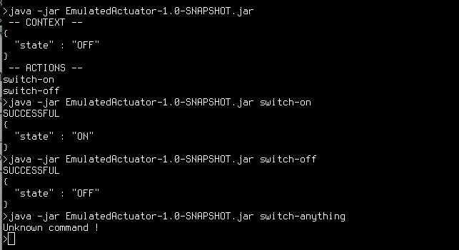

### 1. Prepare Data

Create the description file for Actuator with name **“actuator.data”** in .json format.

#### 1.1. Enum Actuator - Switch Actuator

```json
{
  "name" : "my-switch1",
  "type" : "Switch",
  "context" : { "state" : "OFF" },
  "controls" : {
    "0" : {
      "name" : "turn-on",
      "parameters" : null,
      "conditions" : {
        "state" : "OFF"
      },
      "effects" : {
        "state" : "ON"
      },
      "command" : null
    },
    "1" : {
      "name" : "turn-off",
      "parameters" : null,
      "conditions" : {
        "state" : "ON"
      },
      "effects" : {
        "state" : "OFF"
      },
      "command" : null
    }
  }
}
```


#### 1.2. Range Actuator

    {
    	  "name" : "Range",
    	  "startRange" : 16,
    	  "endRange" : 50,
    	  "currentState" : 16,
    	  "controls" : [ {
    		"name" : "set-default",
    		"stateValue" : 20,
    		"isSet" : true
    	  }, {
    		"name" : "set-high",
    		"stateValue" : 40,
    		"isSet" : true
    	  }, {
    		"name" : "set-low",
    		"stateValue" : 17,
    		"isSet" : true
    	  }, {
    		"name" : "increase-1",
    		"stateValue" : 1,
    		"isSet" : false
    	  }, {
    		"name" : "decrease-1",
    		"stateValue" : -1,
    		"isSet" : false
    	  } ]
    	}
    
### 2. Run Enum Actuator - Switch Actuator

After preparing data, run Switch Actuator by command line:

		java -jar target\EmulatedActuator-1.0-SNAPSHOT.jar [command]
   
For example: **[Command]** as below:

* **state-list:** showing a collection of state values

* **current-state:** showing the state value at the current time

* **action-list:** showing a set of control actions

* **action-name:** executing actions. ex:

* **turn-off:** changing state from “ON” to “OFF”

* **turn-on:** changing state from “OFF” to “ON”


		java -jar target\EmulatedActuator-1.0-SNAPSHOT.jar state-list
    
		java -jar target\EmulatedActuator-1.0-SNAPSHOT.jar current-state
    
		java -jar target\EmulatedActuator-1.0-SNAPSHOT.jar action-list
    
		java -jar target\EmulatedActuator-1.0-SNAPSHOT.jar turn-on
    
		java -jar target\EmulatedActuator-1.0-SNAPSHOT.jar current-state
    
		java -jar target\EmulatedActuator-1.0-SNAPSHOT.jar turn-off
    
		java -jar target\EmulatedActuator-1.0-SNAPSHOT.jar current-state

The following picture are the result when running **“EmumActuator.jar”**

{:width="700px"}.

### 4. Run Range Actuator

After preparing data, run Switch Actuator by command line:

		java -jar target\EmulatedRangeActuator-1.0-SNAPSHOT.jar [command]
    
For example: 

		java -jar target\EmulatedRangeActuator-1.0-SNAPSHOT.jar current-state
		
		java -jar target\EmulatedRangeActuator-1.0-SNAPSHOT.jar set-default
		
		java -jar target\EmulatedRangeActuator-1.0-SNAPSHOT.jar current-state
		
		java -jar target\EmulatedRangeActuator-1.0-SNAPSHOT.jar set-high
		
		java -jar target\EmulatedRangeActuator-1.0-SNAPSHOT.jar current-state   
		
		java -jar target\EmulatedRangeActuator-1.0-SNAPSHOT.jar set-low
		
		java -jar target\EmulatedRangeActuator-1.0-SNAPSHOT.jar current-state
		
		java -jar target\EmulatedRangeActuator-1.0-SNAPSHOT.jar increase-1
		
		java -jar target\EmulatedRangeActuator-1.0-SNAPSHOT.jar current-state
		
		java -jar target\EmulatedRangeActuator-1.0-SNAPSHOT.jar decrease-1
		
		java -jar target\EmulatedRangeActuator-1.0-SNAPSHOT.jar current-state
		
		java -jar target\EmulatedRangeActuator-1.0-SNAPSHOT.jar current-sdfasdf
    
The following picture are the result when running **“EmulatedRangeActuator.jar”**

{:width="700px"}.


