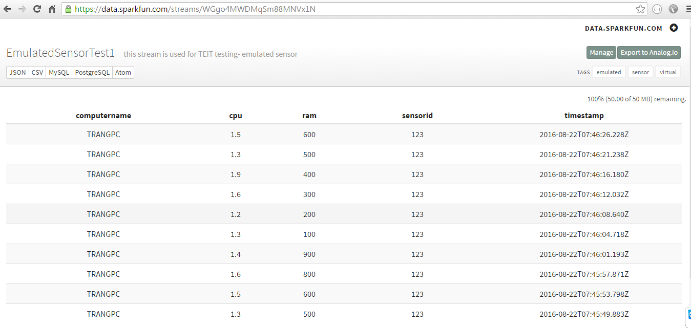
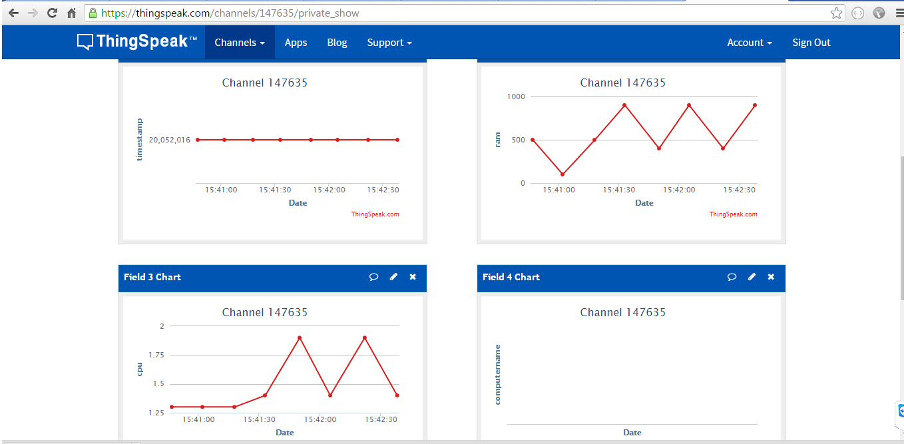

### 1.Prepare CSV data 

**Ex:** CSV file with name ***sensor.data***

    timestamp,cpu,ram,computername
    20052016,1.3,500,TRANGPC
    20052016,1.5,600,TRANGPC
    20052016,1.6,800,TRANGPC
    20052016,1.4,900,TRANGPC
    20052016,1.3,100,TRANGPC
    20052016,1.2,200,TRANGPC
    20052016,1.6,300,TRANGPC
    20052016,1.9,400,TRANGPC
	
**Note:** this data is just an example. You can create your own data with your own fields.

### 2.Emulated Sensor send Data to sparkfun platform:

**Step 1:** Download TEIT from [github](https://github.com/EllaPham/TEIT)

**Step 2:** Open link: https://data.sparkfun.com

**Step 3:** Create a stream with fields the same with fields in CSV file: 

  * cpu
  
  * ram
  
  * computername
  
  * sensorid (mandatory as CSV data will produce this field also)
  
Sparkfun will generate a private key and public key. Save these keys to your computer

**Ex:** 

    Public key: WGgo4MWDMqSm88MNVx1N
    private key: XR6Dq1ma1oFWvv9NEkwN

Then, you can open your stream with url: 

    https://data.sparkfun.com/streams/publickey 
    
For example:

    https://data.sparkfun.com/streams/WGgo4MWDMqSm88MNVx1N

**Step 4:** Configure from **“sensor.config”** file as below:

**Configuration for TEIT (output configurations)**
        
    data=teit.sensor.CSVFile.CSVDataAdaptor
    platform=teit.sensor.PlatformSparkFun.SparkfunPlatform
    rate=3000 
    
**rate:** read csv file data and upload to platform every 3 seconds

**SPARKFUN**

    platform.sparkfun.field=cpu,ram,computername
    platform.sparkfun.publickey=[publickey] 
    platform.sparkfun.privatekey=[privatekey]
    
**For example:** 

    [publickey]=WGgo4MWDMqSm88MNVx1N
    [privatekey]=XR6Dq1ma1oFWvv9NEkwN
    
**Step 5:** From command line screen, run Emulated Sensor:

		java -jar target\EmulatedSensor-1.0-SNAPSHOT.jar
		
Open your stream using public key as step 2 in sparkfun to check the running result: 

{:width="700px"}.

### 3.Emulated Sensor send Data to thingspeak platform:

**Step 1:** Download TEIT  from [github](https://github.com/EllaPham/TEIT)

**Step 2:** Login in this platform: https://thingspeak.com 

**Step 3:** Create a new channel with fields like csv file above:

* Field 1: timestamp

* Field 2: ram

* Field 3: cpu

* Field 4: computername

Then, thingspeak will generate a **Channel ID** (ex: 147635) and an **API Keys** (ex: V53HA4DVOVL2F23M)

**Step 4:** Open “sensor.config” file and edit as below:

**Configuration for TEIT(output configurations)**

    data=teit.sensor.CSVFile.CSVDataAdaptor
    platform=teit.sensor.PlatformThingSpeak.ThingSpeakPlatform
    rate=3000 
	
**rate:** read csv file data and upload to platform every 3 seconds

**THINKSPEAK**

    platform.thingspeak.WriteApiKey=[API key] 
    platform.thingspeak.channel=[Channel ID] 
    
For example:

    [API key] = V53HA4DVOVL2F23M
    [Channel ID] = 147635

**Step 5:** From command line screen, run Emulated Sensor:

    java -jar target\EmulatedSensor-1.0-SNAPSHOT.jar
    
The result after running Emulated Sensor: 

{:width="700px"}.

### 4.Emulated Sensor send Data to MQTT 

**Step1:** Download TEIT  from [github](https://github.com/EllaPham/TEIT)

**Step 2:** From command line screen, typing this command

    java -jar target/MQTTSubscriber-1.0-SNAPSHOT.jar tcp://iot.eclipse.org:1883 mysensor1234
    
After running above command, the result as below:

{:width="600px"}.

