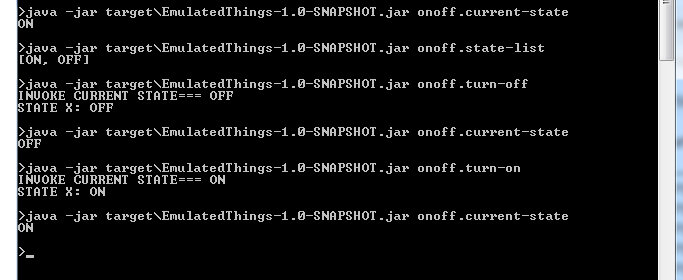

### 1. Prepare Data

This tutorial is used for running “SmartLight”, one of Emulated  Things in **TEIT**. **“Smartlight”** is defined by TEIT as a set of actuators (1 enum actuators & 2 range actuators) with names as below: 
* OnOff actuator (switch actuator)
* Level actuator (range actuator)
* Color actuator

Thus, we need to prepare description files for them. This description file is in **.json** format. The name of description file: **[name].json**

In case smartlight, we have 3 description files as below: 
* onoff.json 
* color.json
* level.json

#### 1.1. The description file of On-Off Actuator 

The content of onoff.json file as below: 

    {
      "name" : "onoff",
      "states" : [ "ON", "OFF" ],
      "controls" : [ {
        "name" : "turn-on",
        "startState" : "OFF",
        "endState" : "ON",
        "parameter" : null
      }, {
        "name" : "turn-off",
        "startState" : "ON",
        "endState" : "OFF",
        "parameter" : null
      } ],
      "currentState" : "OFF",
      "stateList" : [ "ON", "OFF" ],
      "controlList" : [ {
        "name" : "turn-on",
        "startState" : "OFF",
        "endState" : "ON",
        "parameter" : null
      }, {
        "name" : "turn-off",
        "startState" : "ON",
        "endState" : "OFF",
        "parameter" : null
      } ]
    }

#### 1.2. The description file of Level Actuator

The content of level.json file as below: 

    {
      "name" : "level",
      "startRange" : 1,
      "endRange" : 100,
      "currentState" : 16,
      "controls" : [ {
        "name" : "set-default",
        "stateValue" : 45,
        "isSet" : true
      }, {
        "name" : "set-transition-time-10", 
        "stateValue" : 10, 
        "isSet" : true
      }, {
        "name" : "set-stepsize-45", 
        "stateValue" : 45,
        "isSet" : true
      }, {
        "name" : "set-rate-20",
        "stateValue" : 20,
        "isSet" : false
      } ]
    }

#### 1.3. The description file of Color Actuator

The content of level.json file as below: 

    {
      "name" : "color",
      "startRange" : 2700,
      "endRange" : 5500,
      "currentState" : 3000,
      "controls" : [ {
        "name" : "set-default",
        "stateValue" : 3400,
        "isSet" : true
      }, {
        "name" : "set-transition-time-10",
        "stateValue" : 10,
        "isSet" : true
      }, {
        "name" : "set-stepsize-45",
        "stateValue" : 45,
        "isSet" : true
      }, {
        "name" : "set-rate-20",
        "stateValue" : 20,
        "isSet" : false
      } ]
    }

### 2. Run Smartlight by command line: 

After preparing data for actuators. You can run smartlight by command line: 

    Java -jar target\EmulatedThings-1.0-SNAPSHOT.jar [Command]

#### 2.1. Run “onoff actuator” of smartlight 

When you want to run onoff actuator of smartlight:

    Java -jar target\EmulatedThings-1.0-SNAPSHOT.jar onoff.current-state
    Java -jar target\EmulatedThings-1.0-SNAPSHOT.jar onoff.state-list
    Java -jar target\EmulatedThings-1.0-SNAPSHOT.jar onoff.turn-off
    Java -jar target\EmulatedThings-1.0-SNAPSHOT.jar onoff.current-state
    Java -jar target\EmulatedThings-1.0-SNAPSHOT.jar onoff.turn-on
    Java -jar target\EmulatedThings-1.0-SNAPSHOT.jar onoff.current-state
	
Here is the result of running onoff actuator:

{:width="700px"}.

#### 2.2. Run “level actuator” of smartlight

When you want to run level actuator of smartlight:

    Java -jar target\EmulatedThings-1.0-SNAPSHOT.jar level.current-state
    Java -jar target\EmulatedThings-1.0-SNAPSHOT.jar level.set-default
    Java -jar target\EmulatedThings-1.0-SNAPSHOT.jar level.current-state
    Java -jar target\EmulatedThings-1.0-SNAPSHOT.jar level.set-transition-time
    Java -jar target\EmulatedThings-1.0-SNAPSHOT.jar level.set-stepsize
    Java -jar target\EmulatedThings-1.0-SNAPSHOT.jar level.set-rate
	
#### 2.3. Run “color actuator” of smartlight

    Java -jar target\EmulatedThings-1.0-SNAPSHOT.jar color.current-state
    Java -jar target\EmulatedThings-1.0-SNAPSHOT.jar color.set-default
    Java -jar target\EmulatedThings-1.0-SNAPSHOT.jar color.current-state
    Java -jar target\EmulatedThings-1.0-SNAPSHOT.jar color.set-transition-time
    Java -jar target\EmulatedThings-1.0-SNAPSHOT.jar color.set-stepsize
    Java -jar target\EmulatedThings-1.0-SNAPSHOT.jar color.set-rate

