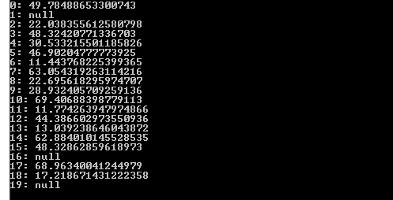
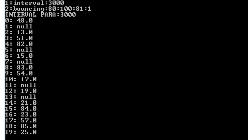

### 1.Prepare Data

#### 1.1.Rule(interval,random)

Each interval time, generating data using random algorithm. The condition file with text format(.txt) and named **“Rule.txt”**. Each record is one rule. The rule consists of 2 elements: **condition** & **function**:

    Rulename->ConditionName:param1:param2..->FunctionName:param1:param2:....

For example: 

    rule1:interval:1000->random:10:30
    rule2:interval:2000->random:40:50
    rule3:interval:3000->random:60:70
    
Interval:1000 -> each 1 second, run rule1

random :10:30 -> random(min,max)

#### 1.2.Rule(interval,bouncing)

Each interval time, generating data using random algorithm. The condition file with text format(.txt) and named **“Rule.txt”**. Each record is one rule. The rule consists of 2 elements: **condition** & **function**:

    Rulename->ConditionName:param1:param2..->FunctionName:param1:param2:....

For example: 

    rule1->interval:1000->bouncing:10:30:11:2
    rule2->interval:2000->bouncing:40:80:45:3
    rule3->interval:3000->bouncing:80:100:81:1

interval:1000 -> each 1 second, run rule1

bouncing:10:30:11:2 ->bouncing(min,max,init,step)

### 2. Generate data for temperature sensor:

#### 2.1. Rule(interval,random)

After preparing data, run generating data by command line: 

    java -jar target\EmulatedEnv-1.0-SNAPSHOT.jar 

The result after running command line above: 

{:width="600px"}.

#### 2.2. Rule(interval,bouncing)

After preparing data, run generating data by command line: 

    java -jar target\EmulatedEnv-1.0-SNAPSHOT.jar 

The result after running command line above: 

{:width="600px"}.

